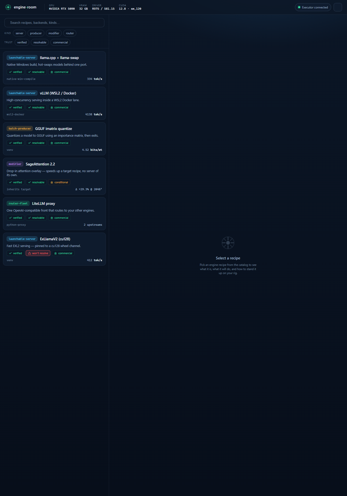
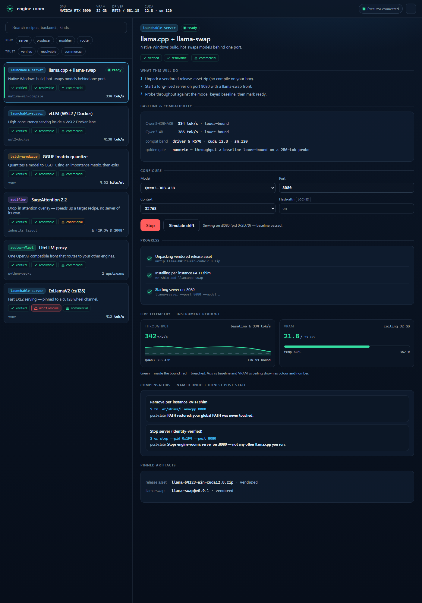
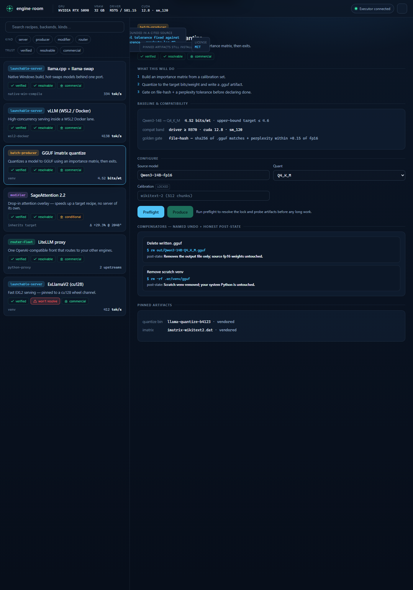
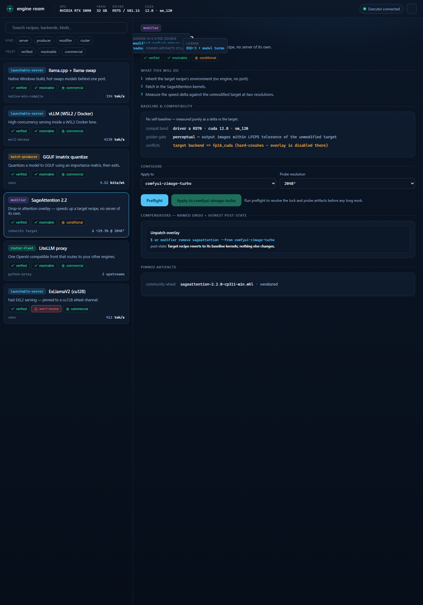
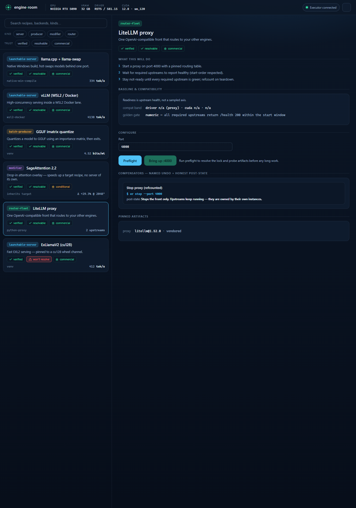
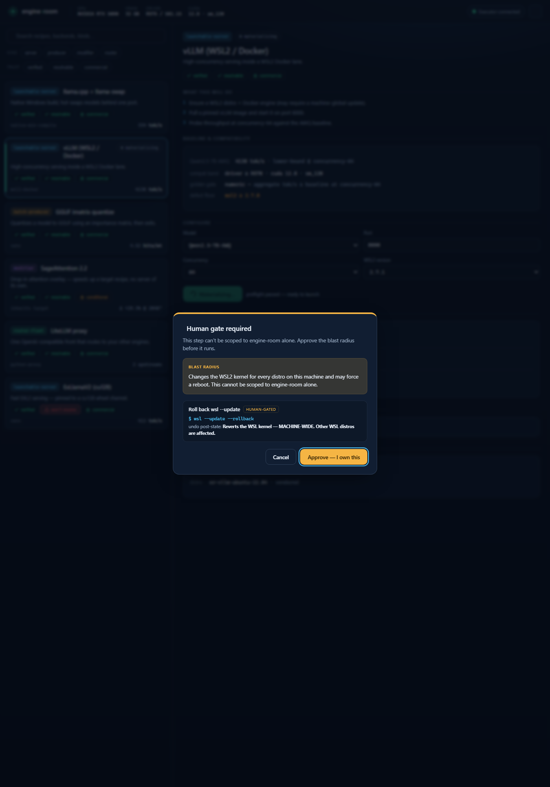
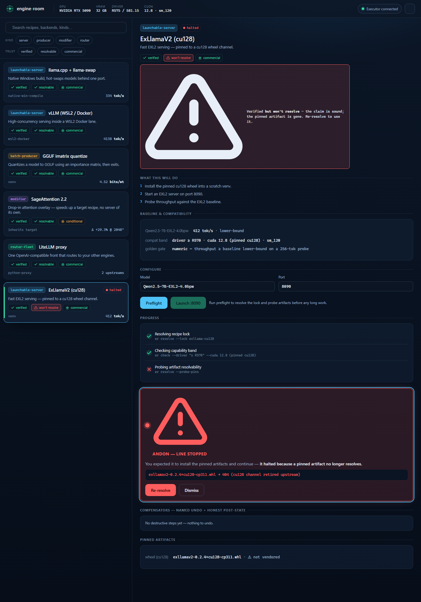

# Control Panel — state gallery

Captured from the live prototype (`../dist/control-panel.html`), driven headless. Every state
below is real UI, not a mockup — the panel was clicked through to each one.

### Catalog (default)
The home: rig strip, search + kind/trust filters, and the six recipes with kind + trust badges.

### launchable-server — running, with live telemetry
llama.cpp launched → materialized → measuring. Model-keyed baselines, progress steps, the live
tok/s sparkline + VRAM-vs-ceiling gauge, the compensator ledger, and vendored pins.

### batch-producer
GGUF quantize: no port, axis is bits/weight, a `file-hash + perplexity` golden, and an **output
artifact** path. Terminates after writing the file.

### modifier
SageAttention: no port, no self-baseline — an "Apply to [target]" overlay measured as a **delta**
against the recipe it patches, with a hard-crash conflict guard and an "Unpatch" compensator.

### router-fleet
LiteLLM proxy: fronts other recipes, refcounted-stop compensator, upstreams owned by their own
instances.

### Human gate (machine-global op)
Launching vLLM pauses at `wsl --update` — a **blast-radius** modal naming the machine-wide kernel
change, the HUMAN-GATED compensator, and its honest post-state. Nothing irreversible runs without
"Approve — I own this."

### ANDON halt + recovery
The cu128 recipe flags the **verified-but-won't-resolve** contradiction (its pinned wheel 404s),
and a launch attempt stops the line with a contrastive cause and a one-click **Re-resolve**
(cu128 → cu130 lineage).

